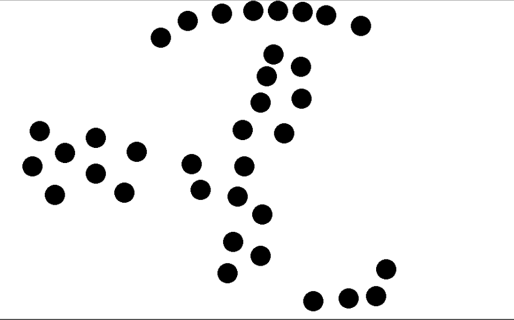
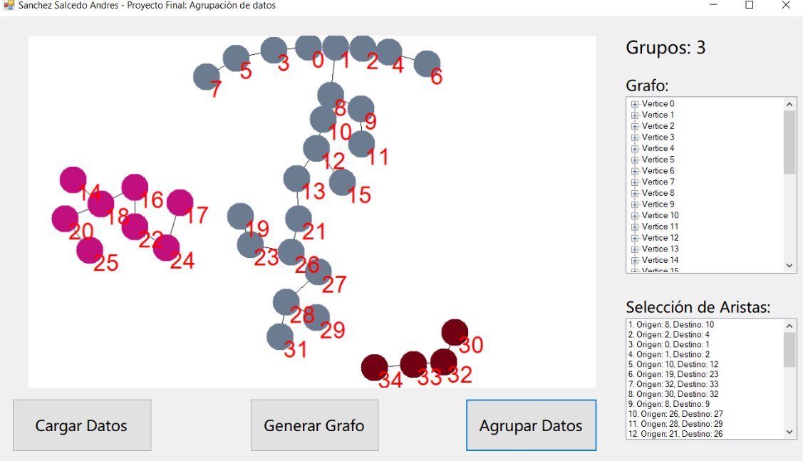

# Gene Clustering

This application takes image input such as the one from the "Tests" folder. 

Each data point is represented by a circle (which in this case I have called "genetic expression data", but this is a general clustering approach), then, the user can select how many clusters they want to obtain, the program will then visually group the data points making use of Kruskal's minimum spanning tree algorithm. The way this works can be thought of as "cutting" the longest *n-1* edges of the resulting tree where *n* is the number of expected clusters. 

Distances are measured using euclidean distance, though the code can be easily modified to change the distance function.

## Example
Observe the following data image, this would be the input to the program

If the users selects that they would expect to have 3 groups in the data, the following would be the output

This gives us the most natural groupings in this data following the given algorithm.

## References
This project is designed with the below articles as reference.
- Ying X., Olman V., Dong X. (2002). Clustering gene expression data using a graph-theoretic approach: an application of minimum spanning trees. Oxford University Press, Vol. 18, No. 4, 536-545.
- CRICK, F. (1970). Central Dogma of Molecular Biology. Nature 227, 561–563.